# Pixovo — Comprehensive Failsafe, Fallback & Resilience Specification

*A complete architectural blueprint of failure conditions, detection mechanisms, automated fallbacks, and honest error strategies across the Pixovo pipeline.*

---

## 1. Core Engineering Principles

Pixovo's resilience architecture is governed by three foundational rules:

1. **Fail Honestly (No Fabricated Output):**  
   Never substitute stock photos, fake albums, or silent dummy data when real data fails. If a system failure or data loss occurs, surface a clean, actionable error to the user. *(Ref: [docs/plans/M1-1.6-fail-honestly.md](plans/M1-1.6-fail-honestly.md))*
2. **Graceful Degradation over Hard Crashes:**  
   When resources (RAM, CPU, GPU, Network) are constrained, step down concurrency, fidelity, or offload processing before terminating the user journey.
3. **Zero Silent Data Loss:**  
   Original photo assets and session states must survive network drops, page refreshes, and transient server errors through local caching (IndexedDB) and atomic backend transactions (SQLite WAL).

---

## 2. Pipeline Failure Points & Failsafe Strategies

```mermaid
flowchart TD
    subgraph Client["1. Client Ingestion & Device Guard"]
        D1[Device Pre-flight: RAM & Cores] -->|<= 2GB RAM| S1[Throttle Concurrency to 1 + GC Pauses]
        D1 -->|> 2GB RAM| S2[Worker Concurrency 2-4]
        F1[HEIC / RAW Format] -->|Cannot Decode| B1[Bypass Canvas -> Direct Server Stream]
        W1[Canvas OOM / Crash] -->|Circuit Breaker 3 Fails| B1
    end

    subgraph Network["2. Ingest Transport"]
        N1[Network Drop / Offline] --> IDB[Buffer in IndexedDB + Auto-Resume]
        N2[HTTP 429 / 503] --> EXP[Exp. Backoff with Jitter]
    end

    subgraph Filter["3. Phase 1 Quality Filter"]
        Q1[Survivor Starvation: < 12 photos] --> R1[Adaptive Relaxation Pass: Relax Blur/Exposure 15%]
        Q2[Zero Surviving Photos] --> QErr[Honest Validation Error to User]
    end

    subgraph AI["4. Theme & Story AI"]
        A1[Gemini 429 / Outage / Timeout] --> M1[Instant Fallback to Rule-Based 20-Palette Matrix]
        A2[Malformed JSON from LLM] --> M1
    end

    subgraph Solver["5. DSA Layout Solver"]
        L1[Aspect Ratio Starvation: All Panoramas] --> V1[Fallback 1-up / 2-up Adaptive Margins]
        L2[DPI Underflow: < 150 DPI] --> Bad1[Pre-flight Quality Warning Badge]
    end

    subgraph Storage["6. 300 DPI Originals Storage"]
        K1[Disk Quota Exceeded > 60GB] --> G1[Reject Ingest HTTP 507 + Auto-Sweep Expired Sessions]
        K2[Export with Missing Originals] --> H1[Warn User + Offer Draft Export with 512px Thumbnails]
    end

    subgraph PDF["7. Print PDF Compilation"]
        P1[RAM Exhaustion > 100 Spreads] --> C1[Page-by-Page Incremental File Streaming]
    end
```



---

## 3. Detailed Specification by Stage

### Stage 1: Client Downsampling & Device Resource Failsafes

#### 1.1 Trigger Conditions & Hardware Gates
* **Low-Memory Device (`navigator.deviceMemory <= 2` GB):**
  * *Risk:* 4 concurrent 48MP image decodes take $4 \times 192\text{ MB} = 768\text{ MB}$ uncompressed RAM, causing the browser or OS kernel to kill the tab.
  * *Failsafe:* Automatically set `concurrency = 1`. Inject a 10ms micro-yield (`await new Promise(r => setTimeout(r, 10))`) between photos to give browser Garbage Collection time to purge uncompressed RGBA bitmaps.
* **Low-Core Device (`navigator.hardwareConcurrency <= 2`):**
  * *Risk:* CPU starvation freezes the main UI thread, triggering the browser's *"Page Unresponsive"* dialog.
  * *Failsafe:* Cap worker pool to 1 background thread. Clamp target downsample dimensions to 400px instead of 512px if processing over 100 photos.
* **Apple HEIC / Camera RAW Formats:**
  * *Condition:* File extensions `.heic`, `.heif`, `.cr2`, `.nef`, `.arw`, `.dng` cannot be decoded by standard browser `<canvas>` or `createImageBitmap()` on non-Apple/non-Safari platforms.
  * *Failsafe:* Automatically bypass client-side canvas downsampling. Route these files directly to the server fallback stream (`POST /api/photobook/ingest-raw`), where Python's `libheif-py` and `rawpy`/OpenCV decode them in 64-bit server space.

#### 1.2 Runtime Canvas Failures & Circuit Breaker
* **OOM / `createImageBitmap` Failure:**
  * If a single photo throws a memory exception during decoding, retry once at a lower resolution (256px).
  * If it fails a second time, do not crash the batch. Mark the file as `downsample_failed` and queue it for server-side processing.
* **Watchdog Timeout:**
  * If a single image worker takes longer than **3,000 ms**, terminate the worker thread, spawn a clean replacement worker, and reroute the stalled photo to the server stream.
* **Consecutive Error Circuit Breaker:**
  * If **3 consecutive photos** fail client downsampling in a single session, trip the circuit breaker: immediately halt all in-browser canvas processing and switch the entire remaining batch to direct server-side upload.

#### 1.3 Memory Leak Prevention
* In `PhotoUploader.jsx`, never accumulate raw `URL.createObjectURL(blob)` handles in long-lived state. Revoke them immediately once rendered or when unmounting (`URL.revokeObjectURL(url)`).
* Worker threads must explicitly invoke `bitmap.close()` immediately following `ctx.drawImage()`.

---

### Stage 2: Ingestion & Network Transport Failsafes

#### 2.1 Intermittent Disconnection & Offline Resiliency
* **IndexedDB Local Staging:**
  * Original 300 DPI files are committed to local browser IndexedDB *before* upload starts.
  * If the network drops mid-upload, the queue pauses. When connectivity returns (`window.addEventListener('online')`), the upload worker resumes from the exact last acknowledged photo.
* **Chunked Thumbnail Transmission:**
  * Photos are sent in small, fixed chunks of 40 thumbnails (`/api/photobook/ingest`) alongside a persistent `session_id`.
  * Each chunk is idempotent: re-transmitting an already-received chunk updates existing records rather than duplicating them.

#### 2.2 Server Rate Limiting & Transient Network Errors
* **HTTP 429 (Too Many Requests) / HTTP 502/503/504:**
  * Network requests implement exponential backoff with full jitter:
    $$T_{\text{wait}} = \min(30000, 2^{\text{attempt}} \times 1000) + \text{random}(0, 500)\text{ ms}$$
  * Maximum 5 retries before prompting the user with a *"Network unstable. [Retry]"* button.

---

### Stage 3: Phase 1 Quality Gate & Filter Engine Failsafes

#### 3.1 Survivor Starvation (Too Many Photos Rejected)
* **Problem:** A user uploads 30 photos, but 26 are flagged as blurry or underexposed. The remaining 4 photos are insufficient to create a photobook (minimum 12 photos required for a 16-page book).
* **Failsafe (Two-Pass Adaptive Relaxation):**
  1. *Pass 1 (Standard):* Run full quality gate (Laplacian variance > 100, Tenengrad > 0.025, exposure guard).
  2. *Pass 2 (Adaptive Recovery):* If surviving photos $< 12$, run a soft-relaxation pass on the borderline rejected photos:
     - Relax blur threshold by 20%.
     - Relax exposure boundaries by 15%.
     - Mark recovered photos with a flag: `quality_warning: "soft_focus"` or `quality_warning: "low_light"`.
  3. If survivors are *still* $< 12$, fail honestly: abort layout generation with HTTP 422:
     > *"Only X photos met minimum print quality standards. At least 12 photos are needed to compose an album. Please add more photos or review excluded items."*

#### 3.2 Burst Duplication Protection
* If an entire batch consists of continuous burst shots (e.g. 50 photos of the same second), the dual pHash deduplicator may thin the batch down to 2 photos.
* *Failsafe:* If deduplication reduces the batch below the minimum spread count, retain the top 2 best-scoring variations per burst cluster (ranked by facial expression/eyes open) rather than only 1 survivor.

---

### Stage 4: Story AI & Theme Generation Failsafes

#### 4.1 Gemini API Outage, Latency, or Rate Limit
* **Hard Timeout:** The backend AI caller wraps external LLM requests with a strict **3.5-second timeout**.
* **Automatic Deterministic Fallback:**
  * If Gemini fails, returns a 429/500 error, or times out, the engine silently and instantly falls back to the local rule-based category matcher:
    - Parses dates from EXIF/metadata (e.g., December $\rightarrow$ "Winter Holiday", weekend timestamps $\rightarrow$ "Weekend Trip").
    - Selects 3 distinct harmonious color palettes from the 20 pre-calibrated canonical palettes matrix in `app/engine/story_ai.py`.
    - Generates clean, typographic cover titles (e.g., *"Memories & Moments"*, *"Highlights of 2026"*).
* **Malformed JSON Output:**
  * Gemini outputs must pass Pydantic schema validation. If the LLM generates truncated or markdown-wrapped invalid JSON, the parser catches the error and activates the local fallback matrix without failing the job.

---

### Stage 5: DSA Layout Solver & Pre-Flight Quality Failsafes

#### 5.1 Aspect Ratio Starvation & Deadlock
* **Problem:** A user uploads 40 ultra-wide panoramic landscape photos (ratio $> 2.2$) or 40 tall vertical smartphone stories (ratio $< 0.5$). The DSA template solver expects varied aspect ratios to pack multi-photo spreads.
* **Failsafe:**
  * When clustering identifies a single-orientation batch ($> 85\%$ same orientation), the solver switches to **Adaptive Uniform Grids**:
    - For Panoramas: Switches to 1-photo-per-page full-bleed horizontal layouts or 2-photo split stacks with calculated letterbox padding.
    - For Tall Verticals: Uses 2-up or 3-up column layouts with synchronized gutters.
  * Under no circumstances will a photo be cropped more than 15% of its height/width to force it into an incompatible slot.

#### 5.2 Pre-Flight DPI Warning Badges
* Each layout slot computes effective print resolution:
  $$\text{DPI}_{\text{eff}} = \frac{\text{Photo Pixel Dimension}}{\text{Slot Dimension in Inches}}$$
* **Quality Badging:**
  * $\text{DPI}_{\text{eff}} \ge 240$: **Green (Excellent)**
  * $150 \le \text{DPI}_{\text{eff}} < 240$: **Yellow (Acceptable)**
  * $\text{DPI}_{\text{eff}} < 150$: **Red (Warning — Blurry in Print)**
* *Failsafe:* Red badges are surfaced in the UI pre-export. The user can either accept the warning, swap the photo to a smaller slot, or reshuffle the spread.

---

### Stage 6: 300 DPI Original Storage & Quota Failsafes

#### 6.1 User Closes Browser Before High-Res Sync Finishes
* **Condition:** A user designs their album, but original 300 DPI files are still syncing from IndexedDB in the background when they attempt to export PDF.
* **Failsafe:**
  * The frontend checks `indexedDB.getPendingCount(sessionId)`.
  * If pending uploads exist, the UI displays a modal:
    > *"Syncing 8 remaining high-resolution originals for commercial printing (75% complete)... Please keep this tab open for 15 seconds."*
  * If the user insists on proceeding immediately, the backend offers a **Draft Preview PDF** (using 512px preview thumbnails with a subtle "DRAFT PREVIEW" watermark) rather than failing or hanging.

#### 6.2 Server Storage Quota & Retention Guard
* **Per-Session Limit:** 3 GB maximum disk storage per session.
* **Global System Limit:** If total disk storage in `UPLOADS_DIR` exceeds **60 GB**, the backend rejects new ingestion with `HTTP 507 Insufficient Storage` and triggers an automated retention sweep:
  * Deletes completed sessions and temporary export PDFs older than 24 hours.
  * Preserves active sessions created within the last 4 hours.

---

### Stage 7: Commercial Print PDF Compilation Failsafes

#### 7.1 Server Memory Containment (RAM Protection)
* **Problem:** An album with 100 spreads rendering 300 DPI uncompressed CMYK bitmaps ($300 \times 8.5 \times 11 \approx 35\text{ MB}$ per page) can exhaust 4–8 GB of server RAM if buffered in memory at once.
* **Failsafe:**
  * In `pdf_exporter.py`, use ReportLab canvas with incremental page streaming:
    1. Draw spread $N$.
    2. Write and flush page buffer to temporary file on disk.
    3. Explicitly dereference image buffers and call Python `gc.collect()`.
    4. Move to spread $N+1$.

#### 7.2 Missing Original Image at Export Time
* In accordance with [Stage 1.6](plans/M1-1.6-fail-honestly.md):
  * **Never replace a missing photo with a stock placeholder.**
  * If an original image was deleted or corrupted on disk:
    1. Attempt to use the 512px preview thumbnail if available, embedding an internal PDF annotation metadata flag `degraded_asset: true`.
    2. Log a high-priority warning with the exact `photo_id`.
    3. If neither original nor thumbnail exists, halt PDF compilation with HTTP 422:
       > *"Asset error: Photo [filename] could not be resolved. Please re-upload this photo to complete your print order."*

---

### Stage 8: Frontend 3D & UI Rendering Failsafes

#### 8.1 WebGL Context Loss in `BookCarousel3D.jsx`
* **Condition:** On mobile devices with low GPU memory, switching tabs or opening camera frequently triggers `webglcontextlost`.
* **Failsafe:**
  * Catch `webglcontextlost` on the canvas:
    ```javascript
    canvas.addEventListener("webglcontextlost", (event) => {
      event.preventDefault();
      setRenderMode("css-fallback"); // Fallback to CSS 3D perspective transforms
    });
    ```
  * The carousel falls back smoothly to CSS-based card flipping with zero interruption to navigation.

#### 8.2 DOM Virtualization in `SpreadViewer.jsx`
* Rendering 50–100 spreads simultaneously crashes mobile Safari DOM trees.
* *Failsafe:* Strict virtualization: only render the currently visible spread $\pm 2$ buffer spreads in the DOM. Off-screen spreads are rendered as lightweight placeholder boxes matching exact spread aspect ratios.

---

## 4. Master Failsafe Reference Matrix

| Subsystem | Failure / Edge Case | Trigger Mechanism | Automated Failsafe Action | User Impact |
| :--- | :--- | :--- | :--- | :--- |
| **Client** | Device RAM $\le 2$ GB | `navigator.deviceMemory` | Throttle to 1 worker; 10ms GC pause | 100% stable; ~15% slower |
| **Client** | HEIC / RAW format | File extension / MIME | Bypass canvas; direct upload to Python | Seamless upload; no crash |
| **Client** | Canvas OOM / crash | Worker exception | Retry @ 256px $\rightarrow$ Circuit breaker to server | Tab survives; no reload |
| **Network** | Network drop | `window.onoffline` / fetch fail | Pause queue; auto-resume from IndexedDB | Zero re-uploads needed |
| **Filter** | $< 12$ photos survive | Quality gate score count | Pass 2 adaptive threshold relaxation (15%) | Salvages soft-focus photos |
| **Filter** | 0 photos survive | Filter output is empty | Honest HTTP 422 error with quality advice | Clean, honest feedback |
| **Theme AI** | Gemini rate limit / outage | 3.5s timeout / HTTP 429 | Instant fallback to 20-palette rule engine | Generation never blocks |
| **Layout** | Monolithic aspect ratios | Aspect ratio variance $< 0.1$ | Switch to uniform column/split grid | Zero awkward photo crops |
| **Storage** | Disk $> 60$ GB | Server disk monitor | HTTP 507 + trigger 24h retention sweep | Protects server OS |
| **PDF** | Missing 300 DPI original | File miss in `UPLOADS_DIR` | Fallback to thumbnail + warn, or honest 422 | Never prints fake stock images |
| **Frontend** | WebGL context loss | `webglcontextlost` event | Switch from WebGL to CSS 3D transform | Smooth carousel persists |
